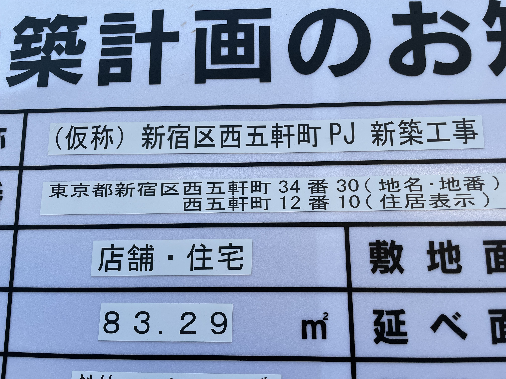

# 不動産共通 ID についてのよくある質問

## 住所変更にはどのように対応していますか？また、新築・取り壊しの場合の ID 変更はいつ・どのように行われますか？

変更前の住所と変更後の住所に対して、別々の ID を発行しています。

その後、変更前と変更後の住所が同じ建物を指すということが分かれば、ID の統合を行います。新築、建て替えや取り壊しについても同様です。現在、住所の変更は管理画面から寄せられる、ユーザーからの報告をもとに対応しています。

## データが本物かどうかの判定やエビデンス（信頼性）は何によって担保されていますか？

GeoTechnologies 社のジオコーダーが保持しているデータに該当した場合に本物と判定しています。

GeoTechnologies 社にデータがない場合でも、正しく正規化ができた住所に対しては ID を発行しています。レスポンスに含まれるジオコーディングレベルの値によって、信頼性の程度を確認できます。今後、不動産共通 API のレスポンスに `addressPending` というステータスを追加する予定です。 `addressPending` ステータスのついたデータの存在確認の仕組みを準備中です。

この仕様は、できるだけ多くのユースケースに対応することを目的としています。住所の存在が確認できていなくても、一意の値があれば十分なケースでは `addressPending` を気にせず利用できます。

<aside>

ID 発行のフローで利用している正規化エンジンとジオコーダーは、マッチしたレベルの情報を返却します。これらの情報は以下の値として API のレスポンスに含まれます。

<ul>
<li><code>normalization_level</code>: 都道府県、市区町村、町丁目のどこまでリストにマッチして正規化できたか</li>
<li><code>geocoding_level</code>: 上記に加えて街区（番）、建物番号（号）のどこまで座標を含む情報とマッチしたか(有料プランのみ)</li>
</ul>
</aside>

## 履歴はどのように管理され、API として情報共有が行われますか？ 住所が変更されても ID を追跡できますか？

統合された場合は新しい ID のみを返します。更新された場合も最新の情報を返します。削除された ID は実績がなく、レスポンスを検討中です。

<aside>

API のレスポンスについては、<a href="https://geolonia.github.io/prop-id-api/api-specs.html">不動産共通 ID 仕様</a>に記載されています。 
不動産共通 ID API ユーザー用の管理画面からもリンクされています。ユースケースや提案をベースにレスポンスの改善を進めています。

</aside>

## 逆引き（ID 参照 API）では、最新のデータだけが帰りますか? または ID の変更・統合・廃止の履歴などの情報も返りますか?

最新のデータを返します。統合、更新の経緯については、どのように返すべきなのかを検討しています。

<aside>

API のレスポンスについては、<a href="https://geolonia.github.io/prop-id-api/api-specs.html">不動産共通 ID 仕様</a>に記載されています。 
不動産共通 ID API ユーザー用の管理画面からもリンクされています。

</aside>

## 全国の何割をカバーしていますか？

都市部の住居表示住所の場合は 95% 以上、郊外など、地番住所しかない場所だと4割以下となっています。
リクエストされた住所の特質（地番 / 住居表示、都市部 / 郊外、古い / 新しい）によって、得意不得意の差が激しいです。

<aside>
<ul>
<li>得意: 住居表示住所、流通している住所</li>
<li>不得手: 地番住所、新築の建物の住所、古くてデータになっていない住所</li>
</ul>
</aside>

## 更地、山林、農地なども ID が返りますか？ 土地や駐車場などの建物がないものも有料プランならジオコーディングできますか？

更地、山林、農地、駐車場の住所は地番住所（土地の住所）です。住所の正規化、ジオコーディングができれば ID と座標を返します（座標は有料プランのみ）。
住所の正規化が成功し、ジオコーディングができない場合には `addressPending` ステータス付きの ID として扱われます。

## 地番の分筆、合筆時に ID はどうなりますか？

現在は、住所変更や統合への対応と同じです。別々の ID が発行され、分かれたこと、統合されたことが確認できれば統合を行います。
地番への対応は、分筆や合筆を検知することや、その情報確認が難しく、大きな課題になっています。

## 土地と建物は別の不動産ですが、どのような ID になりますか？

別々の住所として処理されます。ID も別の ID が発行されます。
土地と建物が重なっている場合の紐付けなどの対応方法は検討中です。

<aside class="sanko">

建築計画のお知らせ看板の例。住所に注目すると、文字列の形だけでは地番 / 住居表示を見分けることができない例。こうした場合にも対応しつつ、住居表示住所と地番住所を紐付けることは現状できていません。

</aside>

## 不動産会社が管理しているようなデータであれば精度は上がりますか?

不動産共通ID をご利用いただく組織内で管理・更新を施されたデータの方が、ID を高い割合で発行できる傾向があります。

<aside>

API が ID を発行できる割合が高くなるデータの特徴:

<ul>
<li>壊れた住所文字列（途中で切れている、仮データ、入力ミス、OCR ミスなど）が少ない</li>
<li>広告文字列など、住所や建物名ではない文字列がない</li>
<li>住所と建物名が分離されている</li>
</ul>
</aside>
