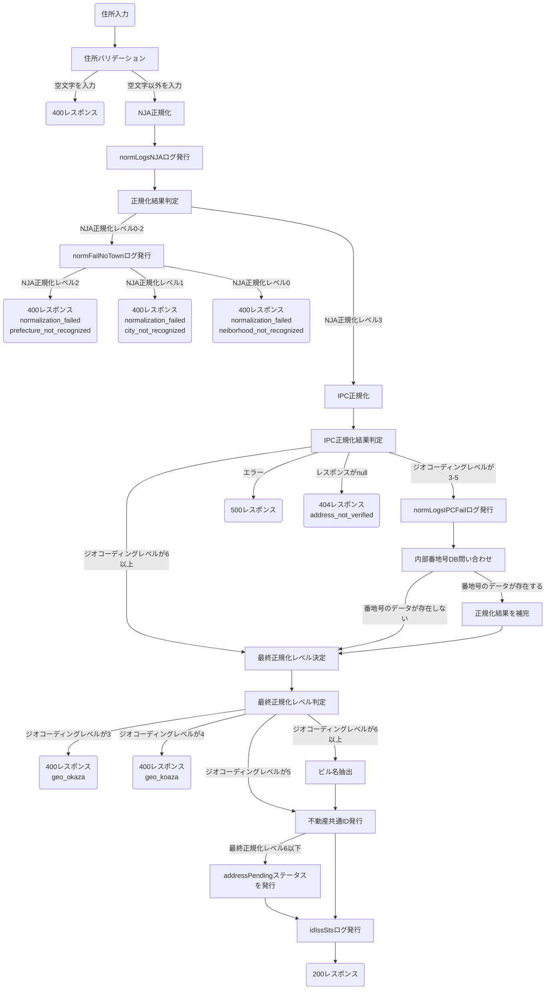

# ID 発行の処理の詳細

```mermaid
graph TD

input(住所入力) --> validation[住所バリデーション]

validation -- 空文字を入力 --> validation_error(400レスポンス)
validation -- 空文字以外を入力 --> NJA_norm[NJA正規化]

NJA_norm --> normLogsNJA[normLogsNJAログ発行]
normLogsNJA --> NJA_norm_level[正規化結果判定]
NJA_norm_level -- NJA正規化レベル0-2 --> normFailNoTown
NJA_norm_level -- NJA正規化レベル3 -----> IPC_norm[IPC正規化] --> IPC_norm_level[IPC正規化結果判定]

IPC_norm_level -- ジオコーディングレベルが6以上 --> norm_finalize[最終正規化レベル決定] --> geoc_lecvel[最終正規化レベル判定]
IPC_norm_level -- ジオコーディングレベルが3-5 --> normLogsIPCFailログ発行 --> query_internal_banchigo[内部番地号DB問い合わせ]
IPC_norm_level -- エラー --> IPC_error_500(500レスポンス)
IPC_norm_level -- レスポンスがnull --> IPC_error_null(404レスポンス<br>address_not_verified)


normFailNoTown[normFailNoTownログ発行]
normFailNoTown -- NJA正規化レベル2 --> NJA_error_2(400レスポンス<br>normalization_failed<br>prefecture_not_recognized)
normFailNoTown -- NJA正規化レベル1 --> NJA_error_1(400レスポンス<br>normalization_failed<br>city_not_recognized)
normFailNoTown -- NJA正規化レベル0 --> NJA_error_0(400レスポンス<br>normalization_failed<br>neiborhood_not_recognized)

query_internal_banchigo -- 番地号のデータが存在しない --> norm_finalize
query_internal_banchigo -- 番地号のデータが存在する --> 正規化結果を補完 --> norm_finalize

geoc_lecvel -- ジオコーディングレベルが3 --> id_issue_error_3(400レスポンス<br>geo_okaza)
geoc_lecvel -- ジオコーディングレベルが4 --> id_issue_error_4(400レスポンス<br>geo_koaza)
geoc_lecvel -- ジオコーディングレベルが5 --> issue_prop_id
geoc_lecvel -- ジオコーディングレベルが6以上 --> ビル名抽出 --> issue_prop_id[不動産共通ID発行]

issue_prop_id -- 最終正規化レベル6以下 --> addressPendingステータスを発行 --> idIssSts
issue_prop_id --> idIssSts[idIssStsログ発行]
idIssSts --> id_issue_ok(200レスポンス)
```
